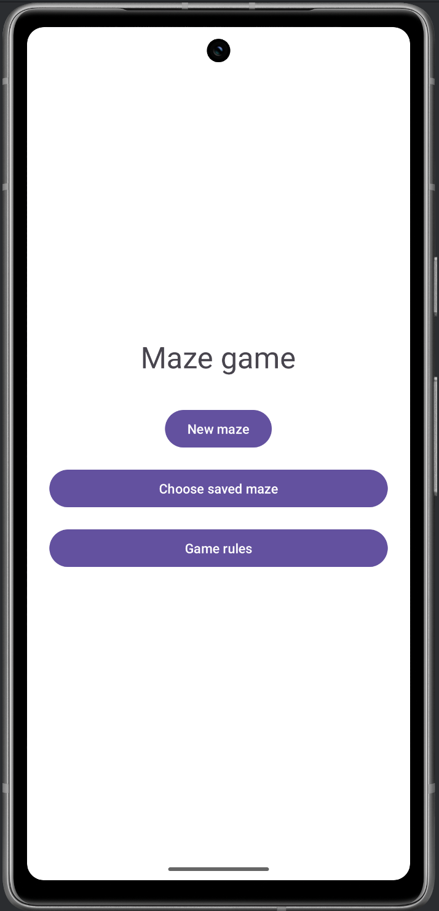
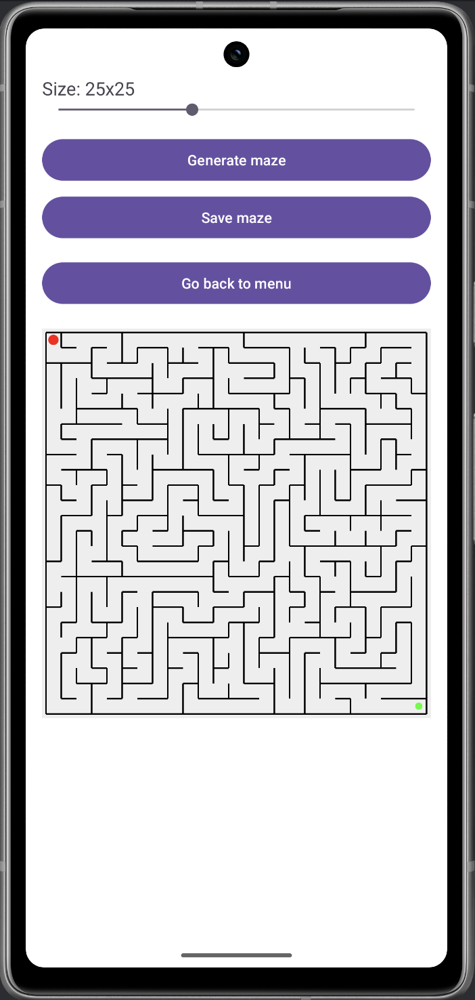
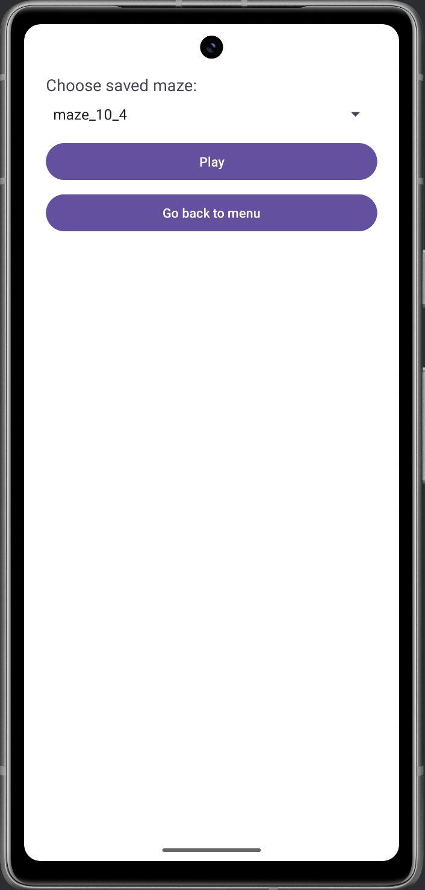
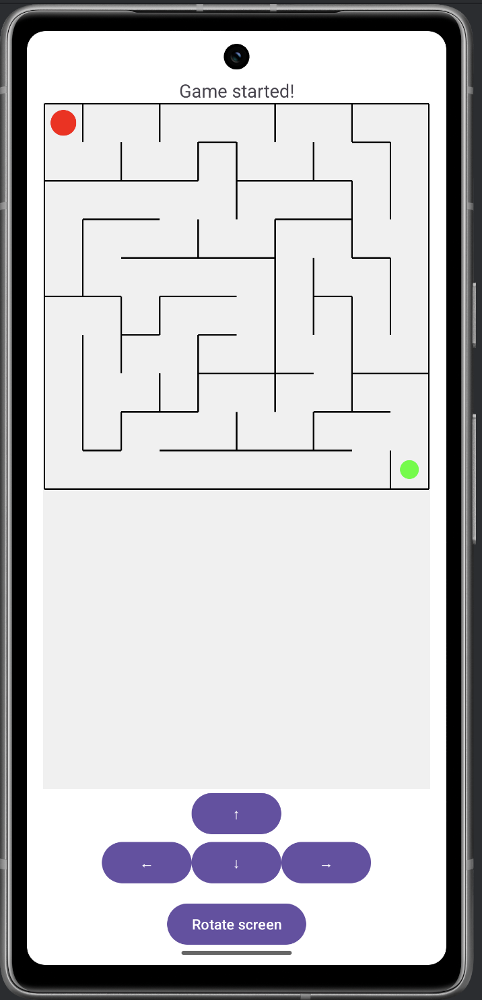
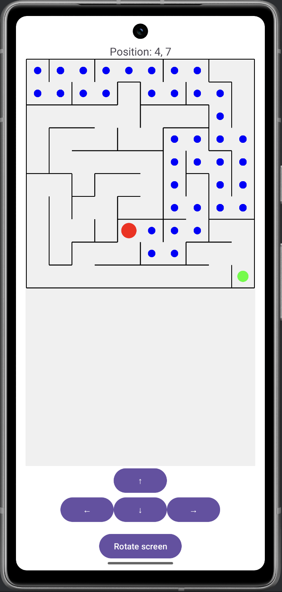
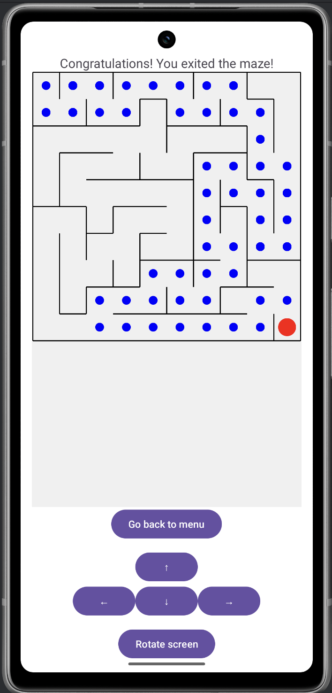
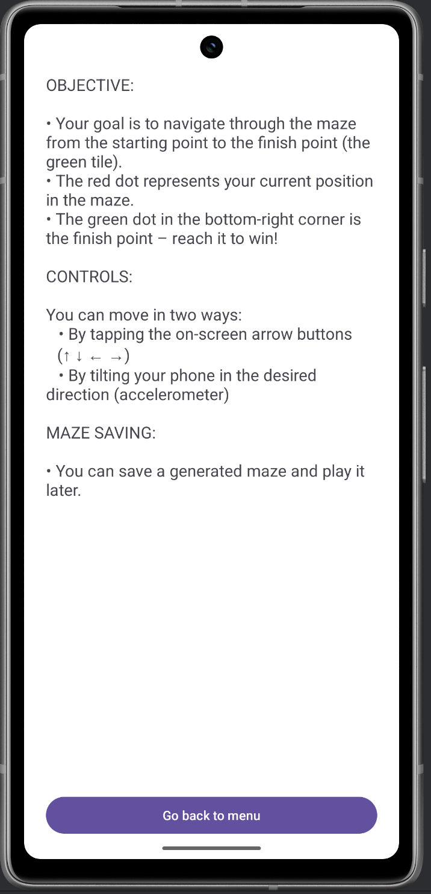

# Maze Game - Android app

This project is an Android application that allows the user to generate and solve mazes. The game is interactive and supports two control modes: using the device’s accelerometer (tilt) or on-screen arrow buttons. The goal is to move the player from the start (top-left corner) to the end (bottom-right corner) of the maze.

## Game Objective

- The player’s position is represented by a red dot.
- The goal is the green dot located in the bottom-right corner.
- A blue trail shows the path visited by the player.
- The player can navigate through the maze corridors avoiding walls.

##  Controls
The game provides two parallel movement control methods:

- Device Tilt (Accelerometer):
    - The user can tilt the device to move in the corresponding direction. The tilt sensitivity is handled via the accelerometer sensor, with direction interpreted based on screen orientation (portrait or landscape).
- On-screen Buttons (↑ ↓ ← →):
    - Four directional buttons are available for moving manually. These buttons work independently or simultaneously with the tilt method.

## How to Play

1. **Start the Application**
   - Launch the app on your Android device or emulator.

2. **Navigate from the Main Menu**
   - You will see three options:
     - **New maze**: go to the maze generator screen.
     - **Choose saved maze**: load and play a previously saved maze.
     - **Game rules**: view detailed instructions and game controls.

3. **Generate a Maze**
   - Tap **New maze** to enter the generator screen.
   - Use the slider at the top to select the desired maze size (between 10 and 50).
   - Tap **Generate maze** to create a new maze of the selected size.
   - Once the maze appears, tap **Save maze** to store it with an auto-generated name like `maze_25_1`.

4. **Load and Play a Maze**
   - Return to the main menu and select **Choose saved maze**.
   - Pick a saved maze from the dropdown list.
   - Tap **Play** to start playing the selected maze.

5. **Game Controls**
   - Your position is shown as a **red circle**.
   - The goal (exit) is the **green circle** in the bottom-right corner.
   - You can move in two ways:
     - **By tilting the phone** (accelerometer sensor).
     - **Using on-screen arrow buttons** (↑ ↓ ← →).
   - You can rotate the screen manually using the **Rotate screen** button.
     - This ensures screen rotation doesn't conflict with motion-based controls.

6. **Game Rules Screen**
   - Use the **Game rules** option from the main menu at any time to review instructions, controls, and objective.

## How to Run the App

### Clone the project from GitHub and open in Android Studio:

1. Open **Android Studio**
2. Select **"Get from VCS"** on the welcome screen  
   *(or go to `File > New > Project from Version Control...`)*
3. In the **URL field**, paste the repository URL:

```bash
https://github.com/olivblvck/Maze.git
```

4. Choose a local directory where the project should be saved  
5. Click **"Clone"**  
6. Wait for **Gradle Sync** to complete  
7. Connect a physical Android device or start an emulator  
8. Click ▶ **Run** or press **Shift + F10**

##  Compatibility

- Requires Android SDK API 24+ (Android 7.0 or higher)
- Optimized for physical devices with accelerometer sensors

## Orientation and Screen Rotation
To avoid conflicts between device tilting and automatic screen rotation, a manual screen rotation button was introduced:
- The game disables automatic orientation changes.
- A “Rotate screen” button allows the player to toggle between portrait and landscape mode explicitly.
- This ensures that tilt controls remain consistent and unaffected by system auto-rotation.
After rotation:
- The current state of the maze, player position, and path are preserved.
- Layout and rendering are restored correctly using lifecycle methods (`onSaveInstanceState`, `reloadLayout`, etc.).

## Key Components

 `MazeGenerator.java`
- Implements maze generation using Depth-First Search (DFS).
- Encodes directions with bit flags for north, south, east, west walls.

 `MazeView.java`
- Custom view responsible for drawing:
  - Maze walls
  - Player’s current position
  - Visited path
  - Goal position
- Dynamically scales and centers the maze display.

 `GameActivity.java`
- Manages game logic and player interaction.
- Handles:
  - Accelerometer sensor input
  - Button listeners for movement
  - Saving/restoring instance state
  - Handling manual screen rotation

 `GeneratorActivity.java`
- Allows the user to select maze size via a SeekBar (from **10 to 50**).
- Displays the generated maze before playing.
- Supports saving generated mazes in `SharedPreferences`.

`HomeActivity.java`, `ParametersActivity.java`, `RulesActivity.java`
- Navigation and configuration screens.
- Game rules are presented in clear instructional format.
- All screens include a return option to the main menu.


## Saving & Loading Mazes

- Mazes can be saved with a format like `maze_25_1` (size and index).
- Saved mazes are loaded from a dropdown menu.
- This enables replaying specific mazes or generating challenges.


## Activity Lifecycle and Persistence

- Player’s current state (position, path, maze layout) is saved using `onSaveInstanceState`.
- Upon screen rotation or configuration change, the game restores its exact previous state using:
  - `onCreate(Bundle savedInstanceState)`
  - `onConfigurationChanged()`
  - `reloadLayout()`

This ensures that gameplay continuity is maintained regardless of orientation changes.

## Screenshots

| Menu | Generating new maze | Choosing saved maze | Entering game |
|--------------|--------------|--------------|--------------|
|  |  |  |  |
| **Playing game** | **Game won** | **Game rules** | |
|  |  | | |


---

## About

This project was developed as part of a coursework assignment at Cardinal Stefan Wyszyński University in Warsaw, for the course Android and Mobile Application Programming.  
Author: Oliwia Witkowska

## 📚 References

- Android Developers: [https://developer.android.com](https://developer.android.com)
- Sensor documentation: [https://developer.android.com/guide/topics/sensors/sensors_overview][https://developer.android.com/guide/topics/sensors/sensors_overview]
- Maze generation algorithm: [https://en.wikipedia.org/wiki/Maze_generation_algorithm]
- Lecture slides, laboratory instructions and guidelines
- Stack Overflow threads related to handling screen rotation and accelerometer events


